# Ex-04-EDA
# AIM:
# Explanation
The primary aim with exploratory analysis is to examine the data for distribution, outliers and anomalies to direct specific testing of your hypothesis.

# ALGORITHM:
###STEP 1:
Import the required packages(pandas,numpy,seaborn).

###STEP 2:
Read the given .csv file.

###STEP 3:
Convert the file into a dataframe and get information of the data.

###STEP 4:
Remove the non numerical data columns using drop() method.

###STEP 5:
Replace the null values using (.fillna).

###STEP 6:
Returns object containing counts of unique values using (value_counts()).

###STEP 7:
Plot the counts in the form of Histogram or Bar Graph.

###STEP 8:
Find the pairwise correlation of all columns in the dataframe(.corr()).

###STEP 9:
Save the final data set into the file.
# Code:
```
import pandas as pd
import numpy as np
import seaborn as np
df=pd.read_csv("supermarket.csv")
df.info()

df.head(10)

df.tail()

df.isnull().sum()

df["City"].value_counts()
df["Gender"].value_counts()
df["Payment"].value_counts()
np.countplot(x="Invoice ID",data=df)
np.countplot(x="Total",data=df)
np.countplot(x='gross income',data=df)
np.countplot(x='Payment',data=df)
np.displot(df["cogs"])
np.countplot(x="Gender",hue="Quantity",data=df)
np.displot(df[df["Product line"]==0]["Total"])
pd.crosstab(df["Payment"],df["Quantity"])
pd.crosstab(df["Gender"],df["Quantity"])
df.corr()
np.heatmap(df.corr(),annot=True)
```
# Output:
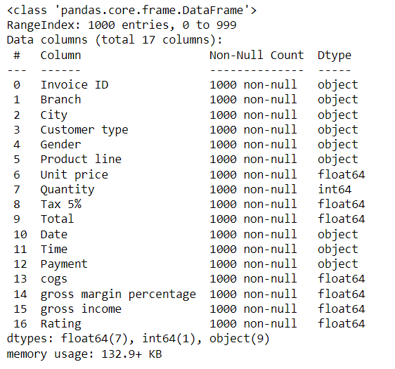

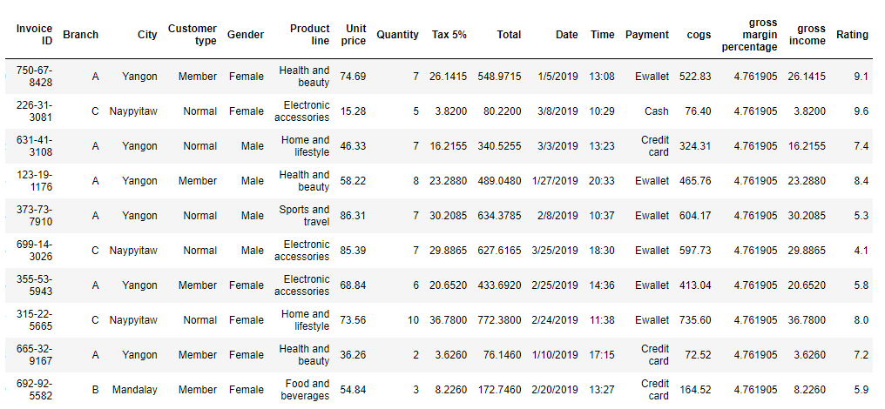

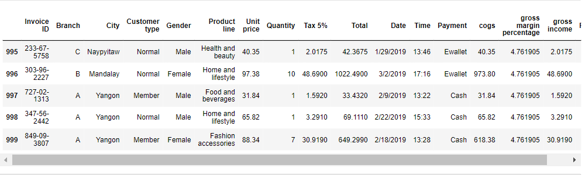

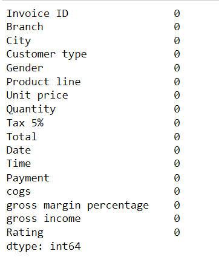

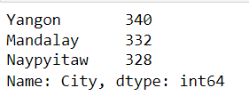

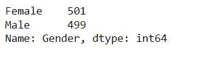


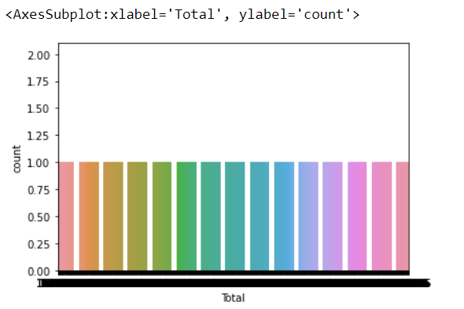

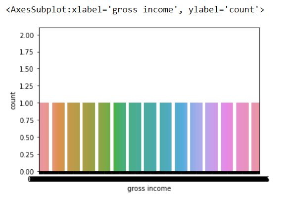

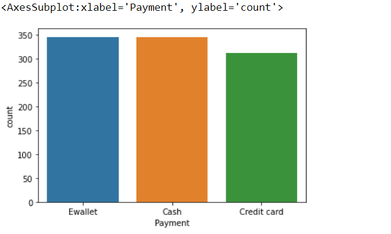

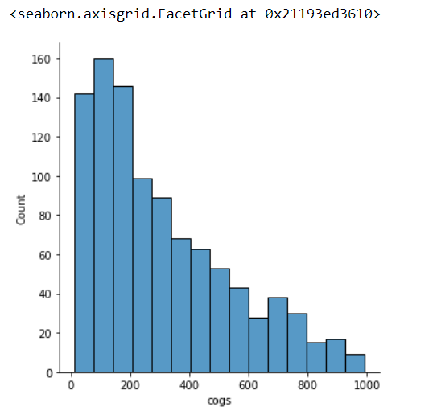

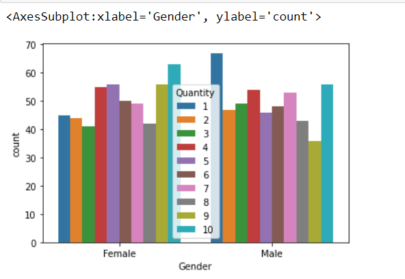

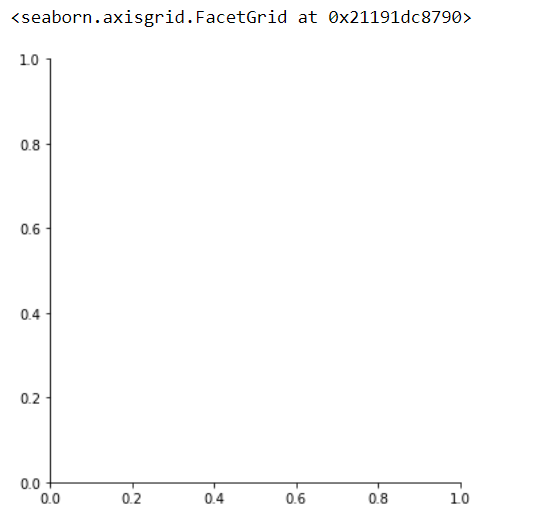

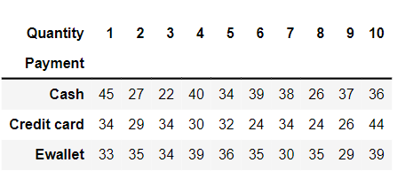

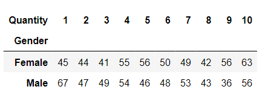

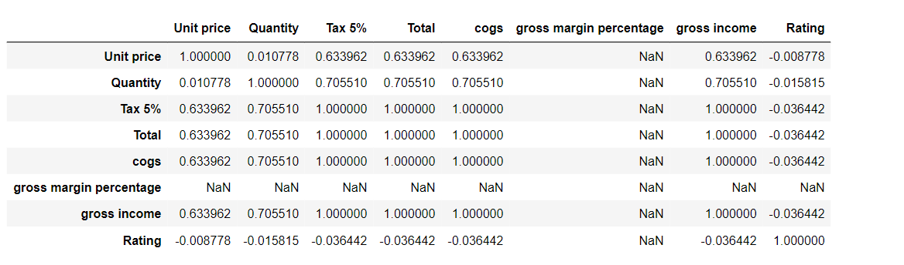

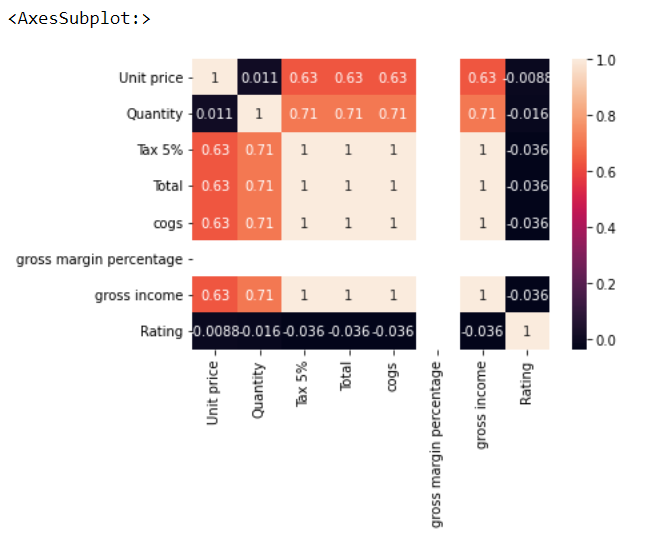

# RESULT:
     Thus the Exploratory Data Analysis (EDA) on the given data set is successfully completed.